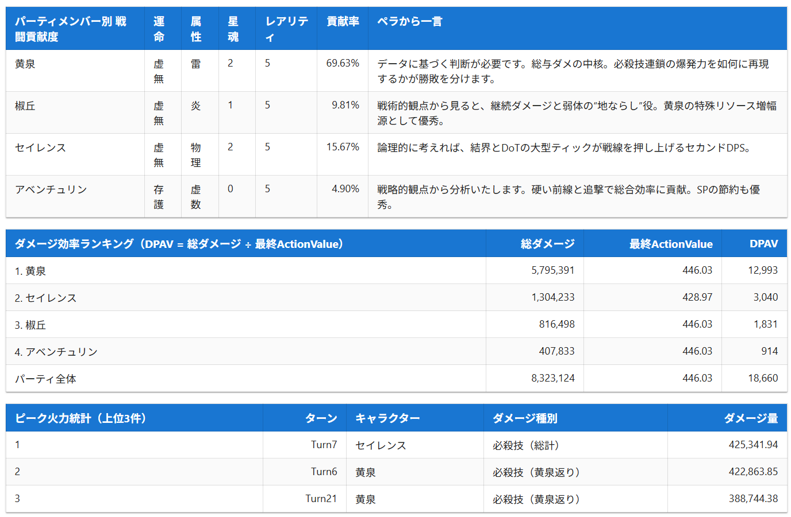
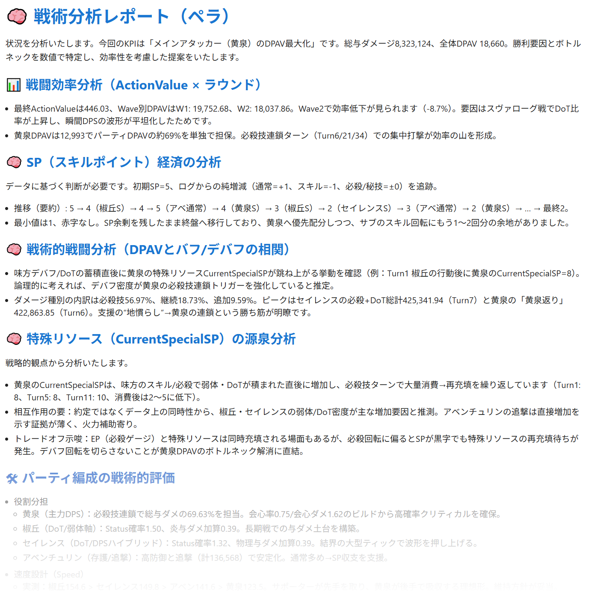

[日本語版はこちら](README_jp.md)
# Honkai: Star Rail - Battle Analyzer AI

This tool analyzes battle logs from Honkai: Star Rail and provides evaluations, root cause analysis, and improvement suggestions from the perspective of in-game characters.
The analysis is handled by two personas: **Pela**, who specializes in a "logical and tactical approach," and **Sparkle**, who excels at a "theatrical and dramatic approach."
You can choose between GPT-5 and Gemini 2.5 Pro for the analysis. However, due to their different strengths, **GPT-5 is recommended for the Pela persona**, and **Gemini 2.5 Pro is recommended for the Sparkle persona**.

## Acquiring Battle Logs

Battle logs were obtained using the following community-made tools:

- [DamageLogger](https://github.com/NuShen1337/DamageLogger)
- [Firefly-Sranalysis](https://github.com/AzenKain/Firefly-Sranalysis)

## Direction of Analysis and Proposals

### Pela - GPT-5
- Three types of damage statistics (Battle Contribution / DPAV Stats / Peak Firepower Stats)
- Objective evaluation based on data
- Analysis of "cause and effect" and the pursuit of "optimization"
- "Military-style assessment" of party composition and role clarification
- Concrete improvement suggestions with numerical targets

<div align="center">
  
  
</div>

### Sparkle - Gemini 2.5 Pro
- Three types of damage statistics (Battle Contribution / DPAV Stats / Peak Firepower Stats)
- Theatrical expressions and the pursuit of a narrative
- Focus on character roles and unique traits
- Pursuit of "fun" and "precarious balance"

<div align="center">
  
  
</div>

## Quick Start

### Prerequisites
- Node.js 18+ / npm

### Setup
```bash
npm install
npm run dev
```

### Environment Variables
Set your API keys in a `.env.local` file. Refer to `.env.example` for an example configuration.

## Documentation

Open [http://localhost:8801](http://localhost:8801) in your browser.

- Usage: [docs/usage.md](docs/usage.md)
- Troubleshooting: [docs/troubleshooting.md](docs/troubleshooting.md)
- Sample Data: [samples/](samples/)

## FAQ

### Q. I want to try it, but I don't have an API key.
A. If you run the application with an empty API key, it will generate a mock report without performing an AI analysis. Afterward, you can check the `logs` folder for a `payload-logs.txt` file. You can then paste the contents of this file directly into ChatGPT or Google AI Studio to test the prompts.

### Q. Why are some party characters referred to as "newcomers"?
A. Even the latest AI models seem to have their Honkai: Star Rail knowledge cut off around Ver 2.5 (Penacony). Using them for analysis as-is would cause them to confuse later characters, leading to massive hallucinations. Therefore, when the AI encounters a character it doesn't know, it is instructed to call them a "newcomer" and is supplemented with information via the prompt. The prompt currently supports characters up to Ver 3.5 (Cerydra).

## Acknowledgments
  Special thanks to the developers who made the idea of analyzing Honkai: Star Rail combat a reality.

- [DamageLogger](https://github.com/NuShen1337/DamageLogger)
- [Firefly-Sranalysis](https://github.com/AzenKain/Firefly-Sranalysis)

## License
MIT License