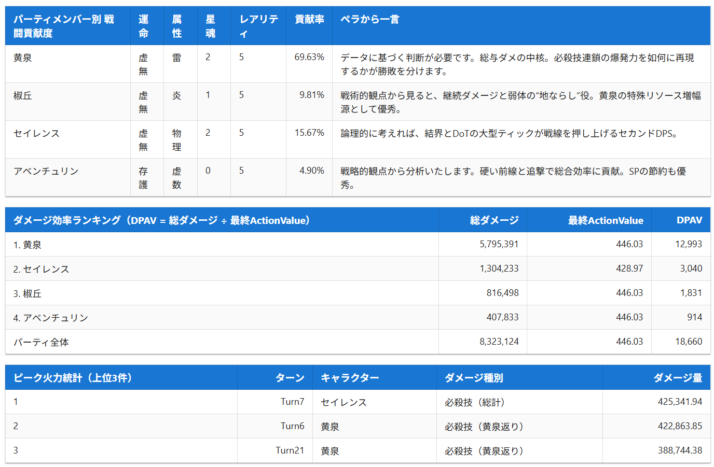
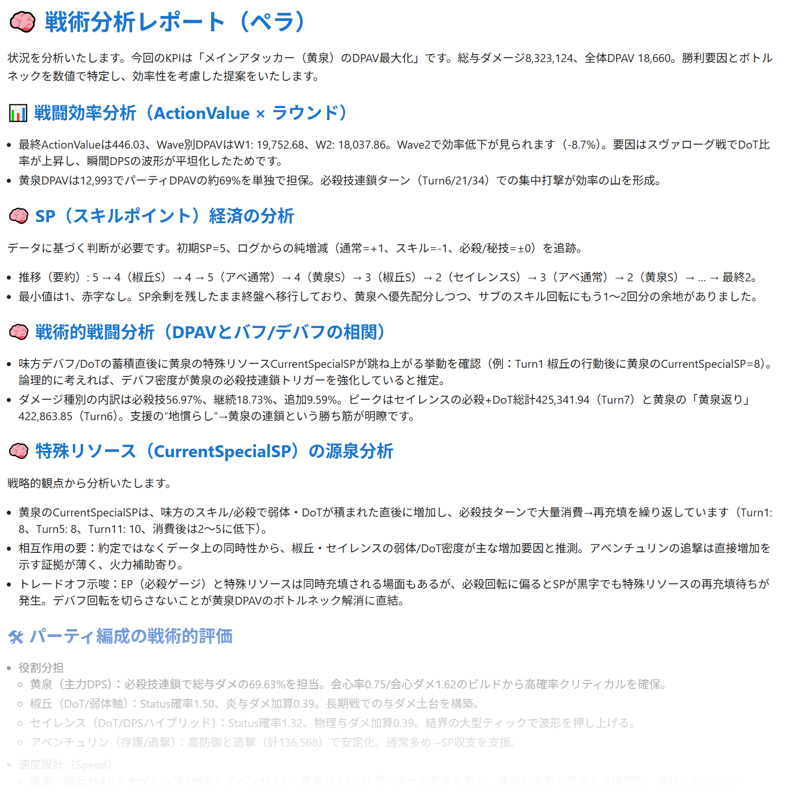
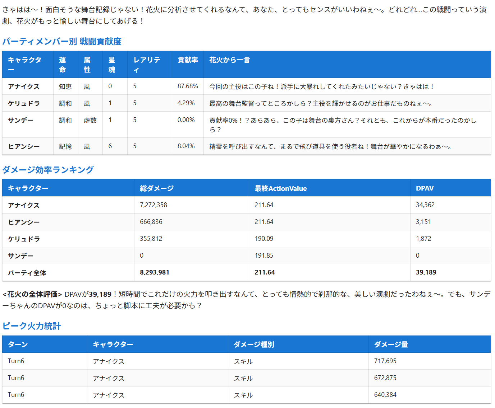
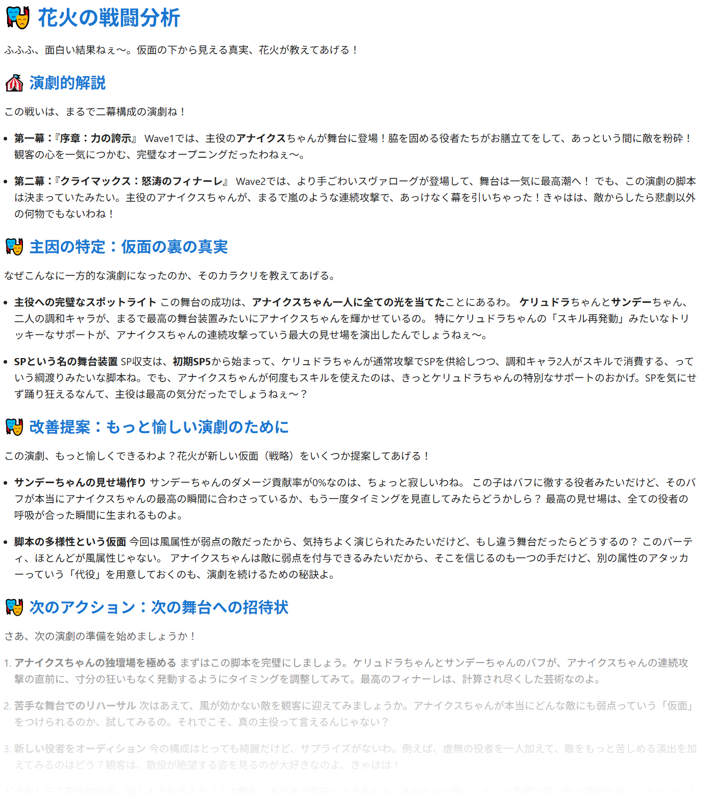

# 崩壊スターレイル - Battle Analyzer AI

崩壊スターレイルの戦闘ログをデータ分析し、キャラクター視点で評価・主因・改善提案を行います。
分析は「論理的で戦術的なアプローチ」が得意なペラと「演劇的でドラマチックなアプローチ」が得意な花火が担当します。
分析に使用するAIはGPT-5とGemini 2.5 Proから選択可能ですが、それぞれに得手不得手があるため、ペラ役はGPT-5 mini、花火役はGemini 2.5 Proを推奨しています。

## 戦闘ログの入手

戦闘ログの入手には以下のコミュニティ製のツールを使用しました：

- [DamageLogger](https://github.com/NuShen1337/DamageLogger)
- [Firefly-Sranalysis](https://github.com/AzenKain/Firefly-Sranalysis)

## 分析・提案内容の方向性

### ペラ - GPT-5 mini
- ダメージ統計3種（戦闘貢献度/DPAV統計/ピーク火力統計）
- データに基づいた客観的評価
- 「因果と流れ」の解析と「最適化」の追求
- パーティ編成の「軍事的評価」と役割の明確化
- 具体的な改善提案と数値目標

<div align="center">
  
  
</div>

### 花火 - Gemini 2.5 Pro
- ダメージ統計3種（戦闘貢献度/DPAV統計/ピーク火力統計）
- 演劇的な表現と物語の追求
- キャラクターの役割と特異性への注目
- 「楽しさ」と「危ういバランス」の追求

<div align="center">
  
  
</div>

## すぐ試す

### 前提条件
- Node.js 18+ / npm

### セットアップ
```bash
npm install
npm run dev
```

### 環境変数
`.env.local` にAPIキー等を設定します。設定例は`.env.example` を参照してください。

## ドキュメント

ブラウザで [http://localhost:8801](http://localhost:8801) を開きます。

- 使い方: [docs/usage_jp.md](docs/usage_jp.md)
- トラブルシュート: [docs/troubleshooting_jp.md](docs/troubleshooting_jp.md)
- サンプルデータ: [samples/](samples/)

## よくある質問

### Q. 試してみたいけどAPIキーを持ってません。
A. APIキーが空の状態で起動するとAI分析されずにモックのレポートが作成されます。その後`logs`フォルダを調べると`payload-logs.txt`が作成されています。このファイルの中身をそのままChatGPTやGoogle AI Studioのプロンプトに貼り付けると試すことが可能です。

### Q. パーティキャラを「新人さん？」と呼んでいるのは何故ですか？
A. 現行使用できるAIの最新モデルであっても崩壊スターレイルの知識はVer2.5（ピノコニー）あたりで止まっているようです。このまま分析に使用するとそれ以降に登場したキャラクタを混同して壮大なハルシネーションを起こします。そこでAIが知らないキャラを見つけたときは
「新人さん」と呼んでもらい、プロンプトで情報を補完しています。プロンプトの情報は現行Ver3.5ケリュドラまで対応しています。

## 謝辞
  崩壊スターレイルの戦闘を分析してみたら何が出てくるのか？そのアイデアを実現させてくれた開発者の方々に感謝します。

- [DamageLogger](https://github.com/NuShen1337/DamageLogger)
- [Firefly-Sranalysis](https://github.com/AzenKain/Firefly-Sranalysis)

## ライセンス
MIT License
