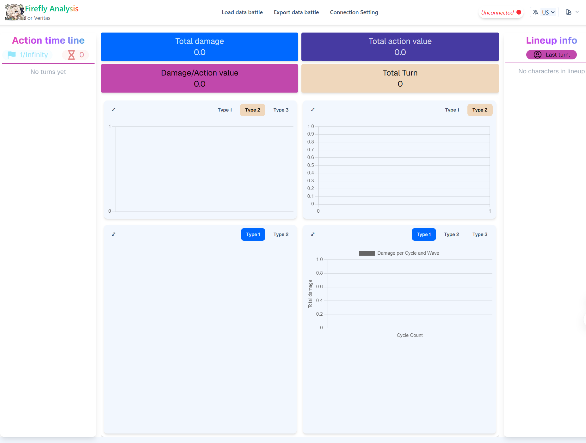

## Troubleshooting

### Common Issues
1.  **500 Error:** Check your API key settings in the `.env.local` file.
2.  **Empty Analysis Result:** Verify the format of your input JSON and check the `battleData` formatting process.
3.  **The analysis result shows enemies that did not appear in the stage.**
    -   To prevent this, reload [Firefly-Sranalysis](http://localhost:3000/) before recording a new battle log.
    -   With a clean state (no data loaded), navigate to `Connection Setting` and then perform an `Export data after battle`.

  

### Logs
-   **Server-side Payload:** `logs/payload-logs.txt` (You can use this file to test the prompt with other LLMs).

### Support
-   Please open an issue on GitHub and attach a minimal reproducible JSON file and a screenshot.
