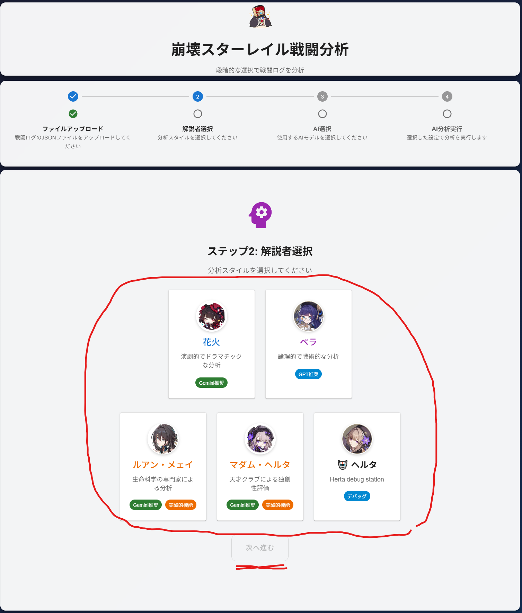
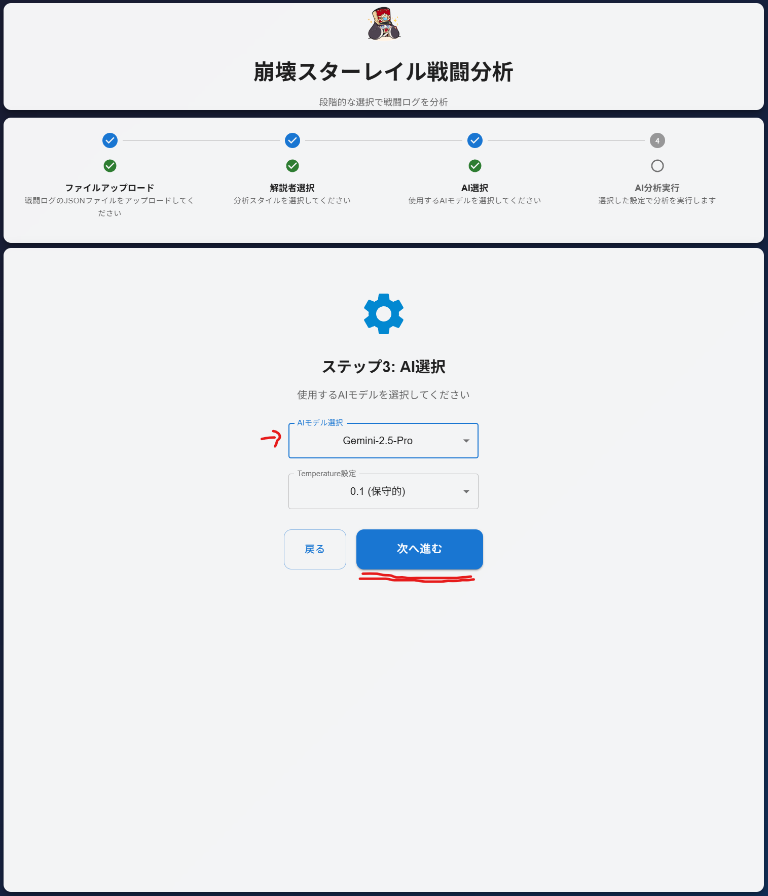

## Usage

### Steps
1. Upload your battle log JSON file.

  

2. Select a commentator (Sparkle / Pela).

  

3. Select an AI model (GPT / Gemini). (Temperature setting is available for Gemini).

  

4. Run the analysis and review the Markdown result.

  

### Model Selection Guidelines
- **Sparkle**: Theatrical & Storytelling (Gemini recommended)
- **Pela**: Logical & Tactical (GPT recommended)

### Note
- If an API key is not set, the application will return a mock result (for development purposes).