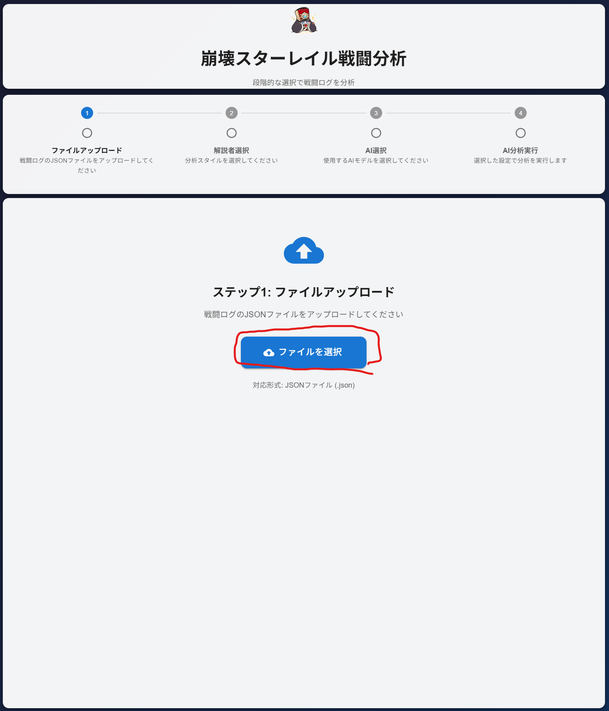
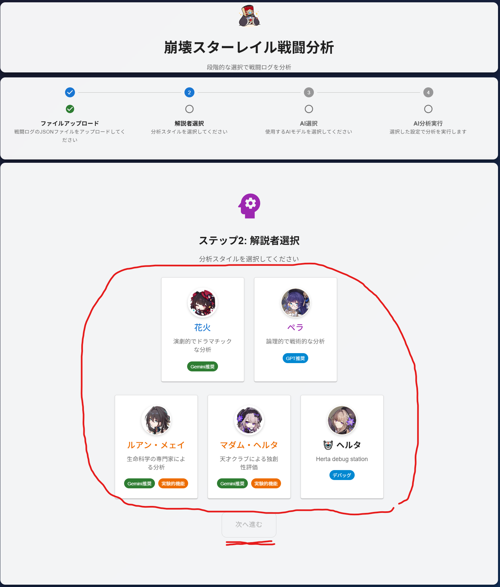
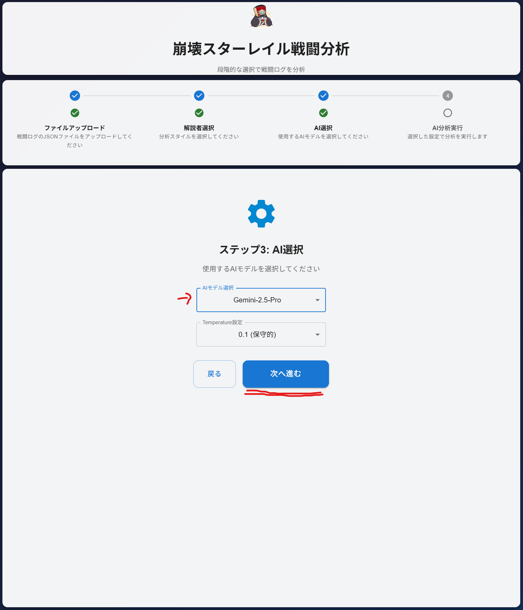
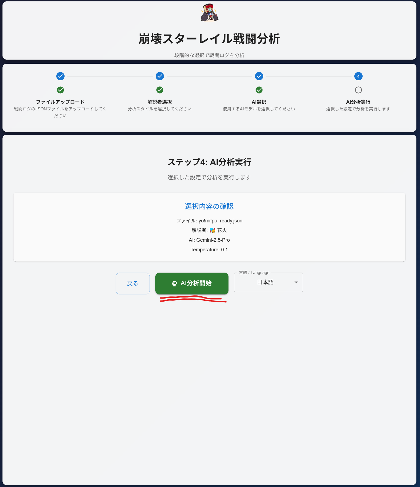

## 使い方

### 手順
1. 戦闘ログJSONをアップロード

  

2. 解説者（花火/ペラ）を選択

  

3. AIモデル（GPT/Gemini）を選択（GeminiはTemperature設定可）

  

4. 分析を実行し、Markdown結果を確認

  

### モデル選択の目安
- 花火: 演劇的・ストーリーテリング（Gemini推奨）
- ペラ: 論理的・戦術的（GPT推奨）

### 注意
- APIキー未設定時はモック結果を返却します（開発向け）

